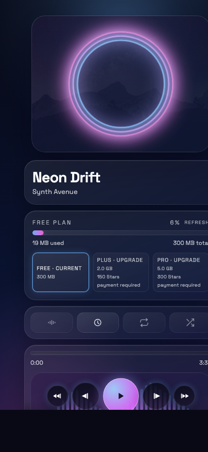

# SoundBot

Русскоязычный open source проект музыкального Telegram Mini App с backend на FastAPI и frontend на React/Vite.

## Скриншот



## Что это

`SoundBot` решает прикладную задачу: собрать личную музыкальную библиотеку из Telegram в одном месте и дать удобный мобильный плеер внутри Mini App.

В проект уже входят:
- авторизация через Telegram `initData`
- библиотека треков с импортом через webhook
- потоковое воспроизведение аудио
- volume/progress controls
- тарифы `free / plus / pro`
- Telegram Stars billing flow
- автоматическое истечение подписок и уведомления

## Текущий статус

Проект находится в рабочем состоянии и подходит как технический MVP.

Зафиксированная точка перед следующим визуальным этапом:
- backend, billing, Telegram webhook, import flow и библиотека работают
- UI функционален и собран в production
- следующим крупным шагом запланирован **полный редизайн интерфейса**

Если нужен откат перед редизайном, ориентируйся на коммит с пометкой про `pre-redesign`.

## Стек

- `FastAPI`
- `SQLAlchemy`
- `Alembic`
- `React`
- `TypeScript`
- `Vite`
- `TailwindCSS`
- `Telegram WebApp`

## Структура

```text
.
├── backend
│   ├── alembic
│   ├── app
│   ├── media
│   └── tests
├── docs
│   └── images
├── frontend
│   └── src
└── docker-compose.yml
```

## Быстрый старт

### Backend

```bash
cd backend
python -m venv .venv
source .venv/bin/activate
pip install -r requirements.txt

export TELEGRAM_BOT_TOKEN=your_bot_token
export TELEGRAM_WEBHOOK_SECRET=your_secret_token
export JWT_SECRET=your_jwt_secret
export DATABASE_URL=sqlite:///./app.db
export MEDIA_CACHE_DIR=media_cache
export DEV_AUTH_ENABLED=true
export DEV_TELEGRAM_ID=100001
export BILLING_ADMIN_TOKEN=dev-billing-admin-token
export BILLING_PAYLOAD_SECRET=dev-billing-payload-secret
export BILLING_INVOICE_TTL_SEC=86400
export BILLING_STARS_CURRENCY=XTR
export BILLING_STARS_PLUS_AMOUNT=150
export BILLING_STARS_PLUS_DAYS=30
export BILLING_STARS_PRO_AMOUNT=300
export BILLING_STARS_PRO_DAYS=30
export BILLING_SWEEP_ENABLED=true
export BILLING_SWEEP_INTERVAL_SEC=3600

alembic upgrade head
uvicorn app.main:app --reload --port 8000
```

### Frontend

```bash
cd frontend
npm install
VITE_API_URL=http://127.0.0.1:8000 npm run dev
```

## Основные API

- `POST /auth`
- `GET /tracks`
- `POST /tracks/import`
- `DELETE /tracks/{id}`
- `GET /stream/{id}`
- `GET /billing/plans`
- `POST /billing/plan`
- `POST /billing/stars/invoice`
- `POST /billing/admin/subscriptions/grant`
- `POST /billing/admin/subscriptions/sweep`
- `POST /telegram/webhook`

## Telegram Stars

Текущий flow:
- пользователь нажимает `Upgrade` в Mini App
- backend создаёт invoice через `POST /billing/stars/invoice`
- Mini App открывает оплату через `Telegram.WebApp.openInvoice`
- `successful_payment` в webhook активирует подписку
- sweep переводит пользователя на `free` после окончания подписки

## Тесты

```bash
cd backend
source .venv/bin/activate
python -m unittest tests.test_billing_flow -v
```

## Деплой

### Backend

Можно деплоить на `Render`, `Railway`, `Fly.io`, VPS или любой Docker-hosting.

Обязательные переменные:
- `TELEGRAM_BOT_TOKEN`
- `TELEGRAM_WEBHOOK_SECRET`
- `JWT_SECRET`
- `DATABASE_URL`
- `MEDIA_CACHE_DIR`
- `BILLING_ADMIN_TOKEN`
- `BILLING_PAYLOAD_SECRET`

### Frontend

Подходит `Vercel`, `Netlify` или любой static hosting.

Минимум:
- build command: `npm run build`
- output: `dist`
- env: `VITE_API_URL=https://your-api-domain.com`

## Лицензия

Проект распространяется под лицензией [MIT](LICENSE).
